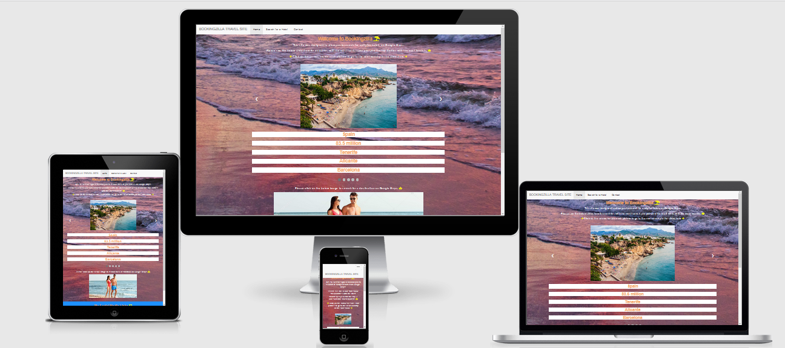
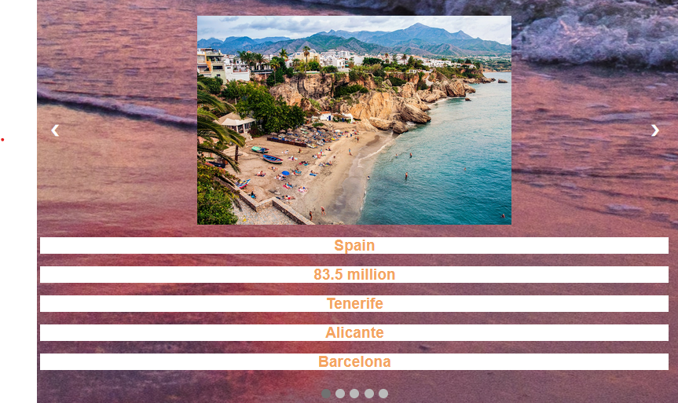
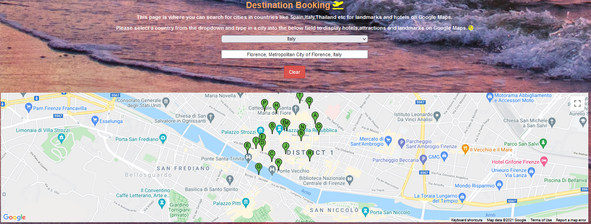
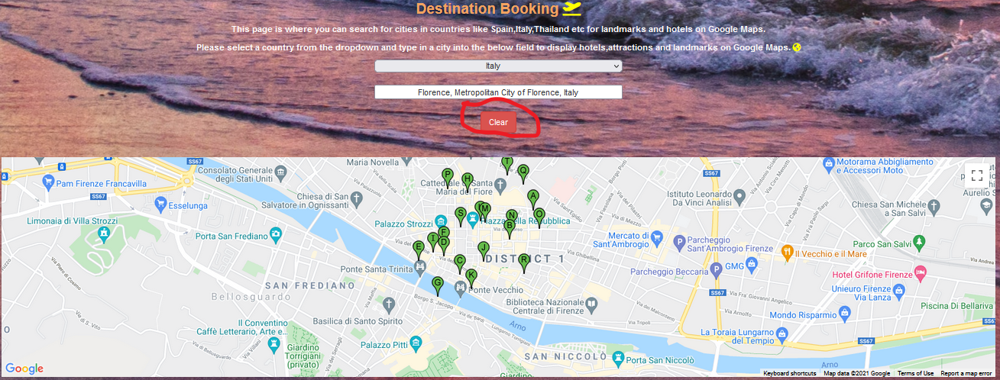
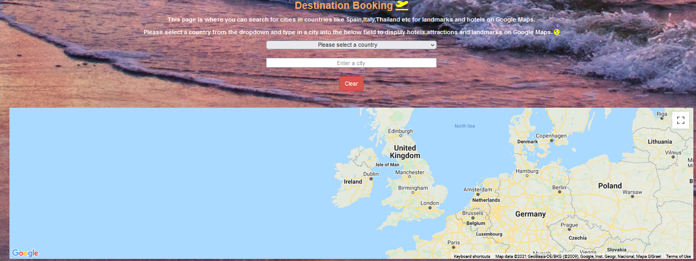
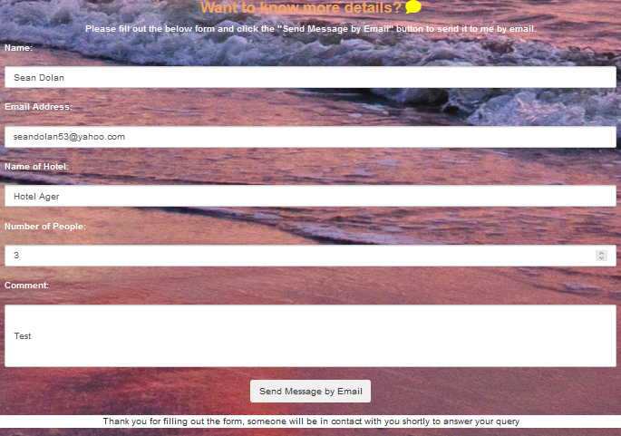
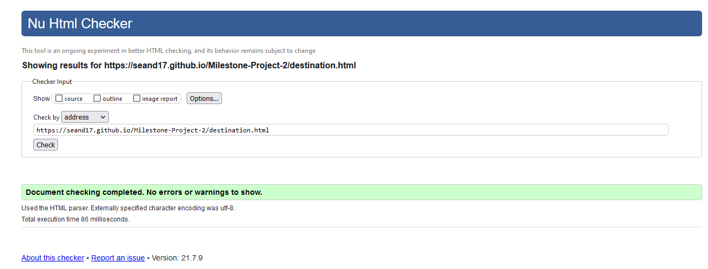
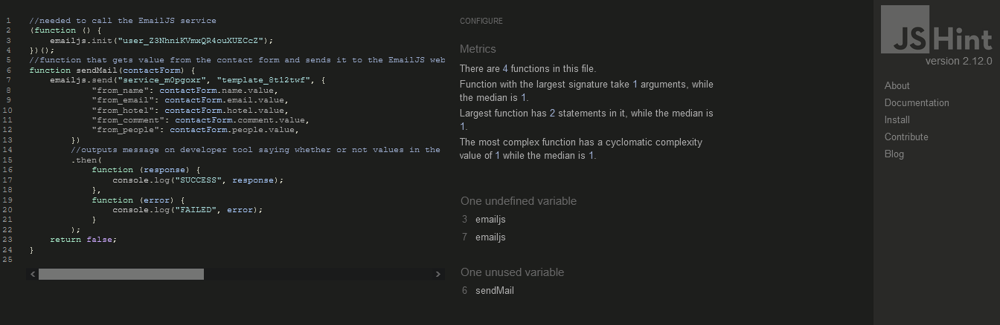
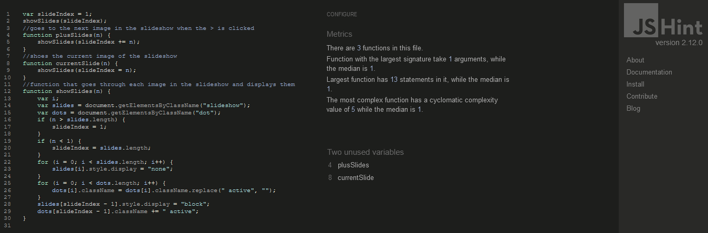

# Milestone-Project-2

<strong>Milestone Project 2</strong>

<strong>Interactive Frontend Development</strong> 

<strong>Code Institute</strong>

<strong>Bookingzilla</strong> 

A holiday booking site to display attractions on a map based on the country the user searches for.

The project has a couple of pages:

1: A homepage listing the most popular destinations as a slideshow and a link to the map.

2: A page with Google Maps and a table below that gets the details of all the hotel markers that a user has searched for in a city. 

3: A page where the user can fill out a contact form about details of a hotel that was displayed on the previous page which is then sent to me by email.

[Link to website](https://seand17.github.io/Milestone-Project-2/) here to see the website.

## Table of Contents
> - [UX](#ux)
> - [User Stories](#user-stories)
> - [Strategy](#strategy)
> - [Scope](#scope)
> - [Structure](#structure)
> - [Surface](#surface)
> - [Icons](#icons)
> - [Skeleton](#wireframes)
> - [Features](#features)
> - [Features Left to Implement](#features-left-to-implement)
> - [Technologies Used](#technologies-used)
> - [Libraries](#libraries)
> - [Version Control](#version-control)
> - [Other](#other)
> - [Testing](#testing)
> - [Deployment](#deployment)
> - [Credits](#credits)
> - [Acknowledgments](#acknowledgments)

## UX:

## User Stories:
As a User:

"I want to see what are the most popular countries tourists are going to each year and what are the top cities."

"I want to search for a particular city on one of the most popular countries I saw from the homepage and see what kind of hotels are there."

"I want to see all the hotels in the city I searched for to be displayed."

"If I make a mistake when searching for a city, I want to delete all so that I can start my search again."

"I want to be able to send an email or fill out a form so that I can get more details on a particular hotel I have found on Google Maps."

## Strategy:
I wanted to create a user friendly website that would display the most popular countries through a slideshow,search for hotels on Google Maps, and to fill out a form that I would receive by email.

## Scope:
I wanted to show users popular travel countries as well as the ability to search for a city for hotels on Google Maps.

## Structure:
I wanted to point the user towards the slideshow of countries that have the most tourists per year.then direct them to the Google Maps page to search for hotels in a city they search for.

I would then direct them towards the contact form that they can fill out.

I also provided my profile links to GitHub and LinkedIn.

## Surface:
I chose the beach background to go with the holiday theme and used white text color to make it stand out against the background.

The blue background footer was chosen to compliment the white text colour.

## Icons:
I used Font Awesome for the social media icons of GitHub and LinkedIn,as well as for various icons seen throughout the site.

## Wireframes:
I have included wireframes for each page on this website, click on the below page names to see these wireframes:

[Homepage](https://github.com/SeanD17/Milestone-Project-2/blob/b4ecb737670ae55172b7f67d1a049dfa0cecfe22/assets/wireframes/Holiday%20Booking%20Homepage.pdf)

[Destination](https://github.com/SeanD17/Milestone-Project-2/blob/c8bba7927154286896b968bd99dd8baef9e5343a/assets/wireframes/Holiday%20Booking.pdf)

[Contact](https://github.com/SeanD17/Milestone-Project-2/blob/b4ecb737670ae55172b7f67d1a049dfa0cecfe22/assets/wireframes/Contact%20Form.pdf)

## Features:

<strong>Existing Features:</strong>

<strong>Feature 1:</strong>
The navigation bar on the top will stay to the screen when the user scrolls down the page when viewing on a tablet or phone for easy navigation as well as link back to the index page.

<strong>Feature 2:</strong>
A slideshow that when clicked on by a user, changes the current image to the next image in the slideshow.

<strong>Feature 3:</strong>
A search bar that allows the user to type in a city and returns the number of hotels in that city that are then displayed on Google Maps.

<strong>Feature 4:</strong>
A results table that is displayed below the Map that shows the number of hotels in the city the user has searched for.

<strong>Feature 5:</strong>
A form that user can fill out and using EmailJS, sends the details into an email template that is then sent to me.

## Features Left to Implement:
I would like to be able to transfer the results table of hotels to the contact page by use of a button, this will make it easy for the user to remember the hotel name that they are emailing about.

## Technologies Used:
[HTML](https://html.com/)
Used to create the structure of the web site.

[CSS](https://www.w3schools.com/css/css_intro.asp)
Used to style the website.

[Bootstrap](https://getbootstrap.com/)
Used to design the site for mobile users and for other features.

[JavaScript](https://www.javascript.com)
Used throughout the web application to perform various functions such as:
 
Loading the map and using co-ordinates to display a default map.

Load the new location on the map based on the Google Places search performed by the user.

Place Markers on the map based on the 'Enter a city' location search, and clear the markers by using a Clear button.

Compile the results of the nearby location search into a table, and build dynamic HTML code to display the results list in a structured table format each time the user completes a search.
 
Build the search results data into an information window which is activated when the user clicks on a marker.

[Google Maps API](https://cloud.google.com/maps-platform/maps/)
Used in this project in order to display a customised and interactive map to display the user's searched location, and also to display customised markers for an additional search of nearby places.

The default map was loaded with a set location using Longitude and Latitude co-ordinates for the country of Spain as it was the first country displayed on the homepage's slideshow.

The zoom level of the map was also set to allow the user to see streets and landmarks around city that the user searched for.

Users can control the zoom on the map, and can zoom in or out with ease.

[Google Places API](https://cloud.google.com/maps-platform/places/)
Used together with the search bar to control the location displayed on the map, and provide autocomplete for place names as search is being completed. 
    
An event listener is used to check the autocomplete search bar for the place_changed event, when this is true, it then calls the OnPlaceChanged function to update the map for the new location.
     
Google Places returns multiple data items on the locations and these are used to fill both the Results table, as well as displaying place details in an information window if the place marker on the map is clicked.
    
A second event listener is used to check if a marker has been clicked and will display an information window with the relevant place details.
    
[EmailJs](https://www.emailjs.com/)
Used to get details from the contact form and then put it into an email template that is then sent to my personal email.

## Libraries:
[FontAwesome](https://fontawesome.com/)
Used frequently for icons used throughout the website.

[Balsamiq](https://balsamiq.com/wireframes/?gclid=EAIaIQobChMIn-_lgbiJ7QIVn4BQBh1X3Av6EAAYASAAEgL1XfD_BwE)
Used for the creation of wireframes.

## Version Control:
[Github](https://github.com/) - Used to store the code and use of Github Pages to deploy the website. 

[Gitpod](https://gitpod.io/) - Used as the primary version control IDE for development to further push and commit code to Gihub.

## Other:
[Code Institute Course Content](https://courses.codeinstitute.net/) - Primary source of learning code.

[W3Schools](https://www.w3schools.com/) - used as a general resource for CSS and coding tips.

[StackOverFlow](https://stackoverflow.com/) - used as a general resource for layout tips or questions.

[AmIResponsive](http://ami.responsivedesign.is/) - Used to check how the layout of the website looks across different devices. 

## Testing:

<strong>Manual Testing of the site</strong>

This website was tested through 3 Web Browsers, Microsoft Edge,Google Chrome and Mozilla Firefox.

The slideshow is expected to go to the previous or next image when the user clicks on one of the arrow beside each image,I tested this by clicking the arrows,the image would then change to the next image in the slideshow.

The enter a city search bar is expected to come up with city suggestions when the user types in a letter or word,however if the user types in a city that does not exist in the country they have picked, e.g. Dublin in Spain, no city name result will show up and after pressing the Enter key a message will appear below the Clear button to let the user know that the city they entered does not exist in the country they are looking at.

All three displayed the exact same website layout without any noticeable changes.

The clear button when clicked on deletes all the hotel markers on the map,and selects the first option in the country dropdown which is "Please enter a city" as well as the city that the user searched for.
In addition, the map goes back to the country of Ireland.

Links on the site when clicked on will open to the same tab,except for the Social Media links in the footer, these are opened on a new tab.

The website was tested on an Android smartphone and a Samsung Tablet.

The website has being designed to accommodate the screen sizes of smartphones and tablets. 

On the Contact form page of the website,all the fields are required and must be filled before clicking the submit button. 

Once the Submit button is clicked, a message is displayed below the Submit button letting the user know that the form details were successfully sent to me by email.

<strong>User Stories Testing</strong>

As a User:

"I want to see what are the most popular countries tourists are going to each year and what are the top cities."

Expected- Slideshow is expected to show users the 5 most popular countries tourists are going to each year when the user clicks on the arrows beside the slideshows image to go to the next image. 

Result-The feature acted normally and I added code to move the arrows to the center of the image.

"I want to search for a particular city on one of the most popular countries I saw from the homepage and see what kind of hotels are there."

Expected - A suggestions of cities on Google Maps is expected to show up when the user types in the city field.

I tested to see if it would pick up cities that are not restricted to the country dropdown,when I entered a city no suggestions would show up but there was no message saying that this city is incorrect and I couldn't continue on with the Google Maps until I clicked the Clear button.

Fix-I added code to the BookingJS file to display a text field below the Clear button to let the user know if that the city they were looking for is not available.

Result - The city search acted as normally and it displayed a message if an incorrect city was entered.

"I want to see all the hotels in the city I searched for to be displayed."

Expected - A list of hotels to be displayed when the users enter a city into Google Maps.

Result - The hotel list displayed normally.

"If I make a mistake when searching for a city, I want to delete all so that I can start my search again."

Expected - When the user clicks on the Clear button the hotel markers on the Map are removed as well as the city the user searched for.

Result -The markers and text were removed when the user clicks on the User button, in addition to selecting the first option in the countries dropdown("Please enter a city") as well as point the map to the country of Ireland

"I want to be able to send an email or fill out a form so that I can get more details on a particular hotel I have found on Google Maps."

Expected - An email is sent to me when the user fills out the contact form.

Result - The form would have no way of telling users whether the form details were sent successfully or if an error had occurred.

Fix-I added code to the EmailJS file to display a text field below the Submit button to let the user know if the form was successfully sent or an issue had occurred while filling out the form.

<strong>Site Responsiveness</strong>

I went on to the [Am I Responsive?](http://ami.responsivedesign.is/) website to check how the layout of the website looks across different devices. 

The layout of the website looked fine on PC,Tablet and MacBook, however on the Mobile device I noticed a small white line at the bottom of the footer.

I also noticed that the arrows on the slideshow used to go to the next picture were align to the center and took up most of the mobile's screen, although the arrows are transparent. 

<strong> HTML Validation</strong>

HTML - [W3C](https://validator.w3.org/) - Markup Validation.

<strong> CSS Validation</strong>

CSS - [W3C](https://jigsaw.w3.org/css-validator/) - CSS Validation.

[Validation Result](https://jigsaw.w3.org/css-validator/validator?uri=https%3A%2F%2Fgithub.com%2FSeanD17%2FMilestone-Project-2%2Fblob%2Fmaster%2Fassets%2Fcss%2Fstyle.css&profile=css3svg&usermedium=all&warning=1&vextwarning=&lang=en)

<strong>JavaScript Validation</strong>

JavaScript - [JSHINT](https://jshint.com/) - JavaScript Validation.

<strong>Project Bugs and Solutions</strong>

When viewed on the AmIResponsive website, I noticed that one of the images was stretched out so far that a horizontal bar was present in the mobile view.

This bug was caused as a result of me setting the image's width to a fixed number of pixels, which caused it to stretch out on smaller devices like the mobile.

This bug was fixed by changing the width pixels to a percentage so that it would automatically resize the image on the mobile view.

<strong>Remaining bugs</strong>

When the user clicks on the arrows of the slideshow to go to the next image, the page size changes to accommodate the image size even though I have set a rule to have the width have an automatic percentage of 50%.

## Deployment:
Once a GitHub account was created, I opened a new repository by clicking the green button "new". 

To create this project, I used the Code Institute's student [template](https://github.com/Code-Institute-Org/gitpod-full-template).

Click on the green "gitpod" button where one is redirected to to [Gitpod](https://gitpod.io/).

Gitpod, a cloud-based version control software or IDE was used to write all code for this project.

It was then pushed or saved in the terminal to Github where it is stored in a [repository](https://github.com/SeanD17/Milestone-Project-2).

Under "Settings", I scrolled down to Github Pages and selected "Master Branch" under source, to where the page was automated.

Once this was selected, the project was pushed to Github pages and the URL is then displayed.

To access the code, it can be run locally by either selecting "clone" which provides an URL one can use on their local machine or "download" which is where one can download the zip file on to their machine.

This website is hosted through GitHub Pages and any changes made to the website are shown almost immediately after pushing to GitHub.

For the website to work an index html had to be created before GitHub Pages can display the website.

To run locally, you can clone this repository directly into the editor of your choice by pasting `git clone https://github.com/SeanD17/Milestone-Project-2.git` into your terminal. 

To cut ties with this GitHub repository, type `git remote rm origin` into the terminal.

In addition,the API key has being secured with HTTP and the API will only run properly when viewed on GitHub pages, any other attempt to view this website will result in the API not working.
## Credits:

## Content:
All text content in this website was written by me.

Tourist numbers used in slideshow on index page was obtained from <a href="https://en.wikipedia.org/wiki/World_Tourism_rankings">here.</a>

## Media:
The photos used in this site were obtained from:

Bed icon obtained from <a href="https://fontawesome.com/icons/hotel">here.</a>

Globe icon obtained from <a href="https://fontawesome.com/icons/globe-americas?style=solid">here.</a>

Map icon obtained from <a href="https://fontawesome.com/icons/map-marked-alt?style=solid">here</a>

Suitcase icon obtained from <a href="https://fontawesome.com/icons/suitcase?style=solid">here.</a>

Plane icon obtained from <a href="https://fontawesome.com/icons/plane?style=solid">here.</a>

Couple boarding plane obtained from <a href="https://www.istockphoto.com/photo/couple-leaving-for-a-vacation-gm951105550-259628198">here.</a>

Couple on beach obtained from <a href="https://depositphotos.com/212620776/stock-photo-happy-young-couple-walking-together.html">here.</a>

Beach background obtained from <a href="https://unsplash.com/@apviktor?utm_source=unsplash&utm_medium=referral&utm_content=creditCopyText">here.</a>

Hagia Sophia in Turkey obtained from <a href="https://www.voanews.com/europe/greek-businesses-move-boycott-trade-turkey-over-hagia-sophia">here.</a>

Colosseum in Italy obtained from <a href="https://www.smithsonianmag.com/smart-news/italy-plans-install-floors-colosseum-1-180976635/">here.</a>

Malaga in Spain obtained from <a href="https://www.hellehollis.com/blog/en/scenic-drives-around-malaga.htm">here.</a>

San Miguel de Allende in Mexico obtained from <a href="https://www.travelagentcentral.com/destinations/san-miguel-de-allende-making-its-mark-culinary-world">here.</a>

Grand Palace in Thailand obtained from <a href="http://www.asiaessencetours.com/destinations/thailand/bangkok/the-grand-palace.htm">here.</a>
  
## Acknowledgments:
I received inspiration for this project from my mentor Nishant Kumar.

I also received inspiration from an Bootstrap mini project that was taught to us as part of our course.
